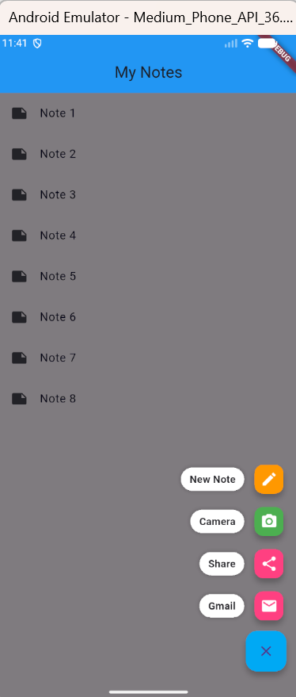

# Expandable FAB (Floating Action Button)
This Notes App showcases the Expandable Floating Action Button (FAB) pattern. Tapping the main FAB reveals a set of contextual mini-action buttons with a smooth animated scrim overlay.

## Features
- Expandable FAB — one button that reveals multiple actions on tap
- Snackbar feedback — tapping a mini action shows a confirmation message
- Scrim overlay — dark background fades in to focus the user's attention
- Dismiss on tap outside — tapping the scrim closes the menu

## Widget Overview
- StatefulWidget: Allows the screen to rebuild when the FAB opens or closes
- setState(): Triggers a UI redraw whenever _isOpen changes
- Scaffold: Provides the screen template (app bar, body, FAB)
- GestureDetector: Detects taps on the scrim to close the FAB
- ScaffoldMessenger: Displays the snackbar notification at the bottom

## Project Structure

    lib/
    └── main.dart       # The app code lives here

## How to Run

Prerequisites:
1. Flutter SDK installed
2. An emulator, simulator, or physical device connected

### Steps

1. Clone or download this project
git clone https://github.com/your-username/expandable-fab-demo.git
cd floactingactionbutton

2. Get dependencies with     flutter pub get

3. Run the app using     flutter run

**You can also paste main.dart directly into DartPad and run it in the browser with no setup required.**

## Real-World Usage
The Expandable FAB pattern is used in many well-known apps:

- Google Drive: to create Docs, Sheets, upload files
- WhatsApp: to start a new chat, group, or broadcast
- Twitter / X: to tweet, start a Space, or write an article
- Todoist: to add a task, project, or label

##  Built With

1. Flutter — UI framework
2. Dart — programming language

## Other Resources

A few resources to get you started if this is your first Flutter project:

- [Lab: Write your first Flutter app](https://docs.flutter.dev/get-started/codelab)
- [Cookbook: Useful Flutter samples](https://docs.flutter.dev/cookbook)

For help getting started with Flutter development, view the
[online documentation](https://docs.flutter.dev/), which offers tutorials,
samples, guidance on mobile development, and a full API reference.
